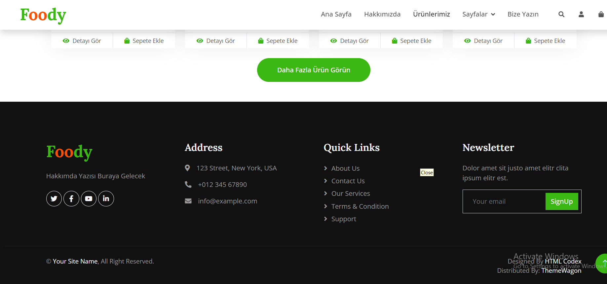

# FoodyTekmerWebUI
# link preview :
https://zeynepdrnxs.github.io/FoodyTekmerWebUI/

<h2> Project Details</h2> 

# tools :
- Html5
- Css
- Bootstrap
- JavaScript
- Media Query
- Ionicons Library
- ASP.NET Core MVC - 6.0
- Entity Framework
- Microsoft SQL Server
- N-Tier Architecture
- Repository Design Pattern
  

# features
- fully responsive e-commerce page 
